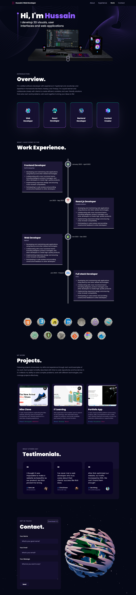

# 🚀 My Portfolio App

Welcome to my **Portfolio App**! This web-based platform showcases my projects, skills, and experience with a sleek, user-friendly interface. You can explore my work, view detailed project showcases, and connect with me for potential collaborations or opportunities.

## 🎨 Features

- **Projects Showcase**: View my top projects with descriptions, technologies used, and source code links.
- **Technologies**: A list of the key technologies and tools I use in my development process.
- **Responsive Design**: Fully responsive design, ensuring great user experience across all devices.
- **About Me**: Learn more about my journey and skills in the "About" section.
- **Contact**: Easily reach out to me through the contact form.

## 🛠️ Built With

- **React.js**: For building dynamic user interfaces
- **Next.js**: Server-side rendering and routing
- **Tailwind CSS**: Utility-first CSS framework for responsive design
- **Supabase**: Backend as a service for authentication and database management
- **Framer Motion**: For smooth animations and transitions

## 🖥️ Live Demo

Check out the live demo of my portfolio: [Portfolio App Live](https://portfolio-hussain-3d.vercel.app/)

## 🧑‍💻 Getting Started

To run this project locally, follow these steps:



1. **Clone the repository**:

```bash
git clone https://github.com/HussainAnjan5/Hussain-portfolio-app.git

